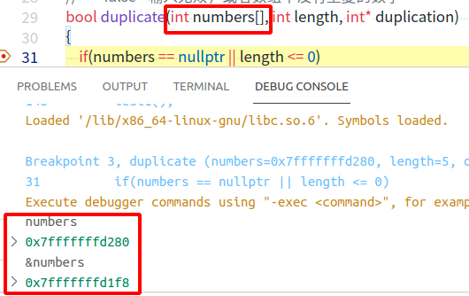
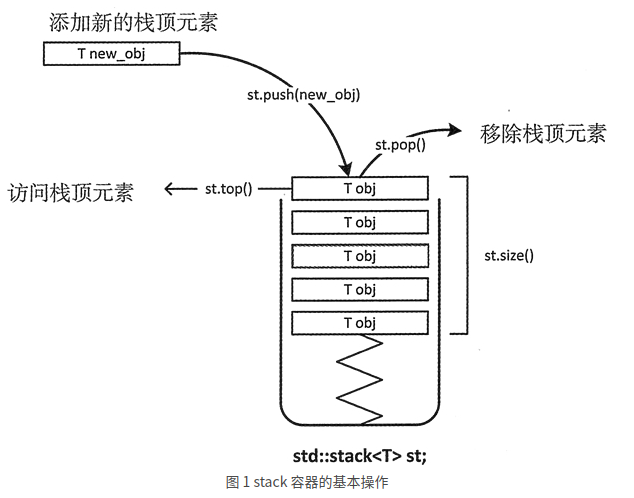

## 1. C++传递数组给函数

  C++传递数组给函数，数组类型自动转换为指针类型，因而传的实际是地址，在函数内修改这个数组，在函数调用后这个数组也就被改变了。参考链接：[C++ 传递数组给函数](https://www.runoob.com/cplusplus/cpp-passing-arrays-to-functions.html)

传给函数的***数组名***和***&数组名***不一样

**以int a[5]为例，数组首元素的地址是数组名a，整个数组元素的地址是&a** . [参考链接：数组名和数组名取地址](https://www.cnblogs.com/lqn1992/p/4659489.html)]




## 2.求数组的长度

int numbers[] = {2, 3, 4, 1, 3};

int length = **sizeof(numbers)/sizeof(int);**

sizeof()求的结果是字节长度

## 3.对于传入的参数是指针的要判断是不是空指针

if(ptr==nullptr)

## 4.strcpy()

使用C++字符数组与使用string对象的不同的一个方式是除了在定义时初始化它，其它时候不能直接给字符数组赋值，要为字符数组赋值，必须要使用strcpy的函数，将一个字符串的内容复制到另外一个字符串中。参考链接：[http://c.biancheng.net/view/1349.html]

## 5.二维数组

二维数组    **类型说明符 数组名[行标] [列标]**;

我发现未初始化的数组好像有点问题，它里面的内容可能和别的数组相同，指针地址也相同，所以**二维数组一定要初始化**。

初始化的几个方法：

``` cpp
// 定义及初始化
int a[2][3] = {{1,2,3},{4,5,6}};
int a[2][3] = {1,2,3,4,5,6};
int b[3][4] = {{1},{4,3},{2,1,2}};  // 只为数组b中的部分元素进行了赋值，对于没有赋值的元素，系统会自动赋值为0

// 赋值
a[1][1]=5;
int k = a[1][2];   // 访问的是元素
auto kk = a[1]  // 访问的是第1行元素（得到的也就是一维数组）
```

[参考链接：C++二维数组的定义和用法](https://www.itheima.com/news/20200508/155103.html)

## 6.(int *) name

将name转换为指向int型变量的指针

## 7.i++和++i

i++, 先引用后增加，先在i所在的表达式中使用i的当前值，后让i加1

++i，先增加后引用，让i先加1，然后在i所在的表达式中使用i的新值

[参考链接：【c++】i++和++i 详解](https://blog.csdn.net/u012679707/article/details/80313425)

for循环里的i++和++i的效果一样，例如for(i=0;i<10;i++)，我认为这是三个执行语句，第三句为i++，所以无论先引用后增加或先增加后引用，在这一句话的效果是一样的。

## 8.strcmp(str,expected)比较字符串是否相同

## 9.C++ STL stack

std::stack 是先进后出的容器



[参考链接：C++ stack(STL stack)用法详解](http://c.biancheng.net/view/478.html)

## 10.printf()

printf()函数在c++里的<cstdio>，在c语言中是在<stdio.h>

## 11.二叉搜索树

二叉搜索树，左子节点<=根(父)节点<=右子节点。

## 12.C++函数模板

```cpp
template <class T> void Swap(T &x,T &y)   // c++11中class可以用typename，也就是可以写成template <typename T>
{
	T tmp = x;
	x = y;
	y = tmp;
}
```

我理解template <class T> 这句话就相当于是定义了一种数据类型T，当某个用到这个数据类型的函数或类调用时，就替换该数据类型为具体的数据类型，进行实例化。
