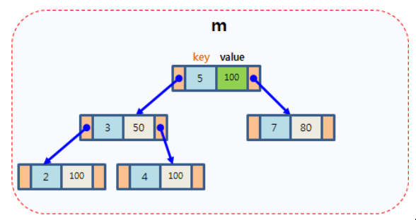

## 1. C++传递数组给函数

  C++传递数组给函数，数组类型自动转换为指针类型，因而传的实际是地址，在函数内修改这个数组，在函数调用后这个数组也就被改变了。参考链接：[C++ 传递数组给函数](https://www.runoob.com/cplusplus/cpp-passing-arrays-to-functions.html)

传给函数的***数组名***和***&数组名***不一样

**以int a[5]为例，数组首元素的地址是数组名a，整个数组元素的地址是&a** . [参考链接：数组名和数组名取地址](https://www.cnblogs.com/lqn1992/p/4659489.html)]


## 2.求数组的长度

int numbers[] = {2, 3, 4, 1, 3};

int length = **sizeof(numbers)/sizeof(int);**

sizeof()求的结果是字节长度

## 3.对于传入的参数是指针的要判断是不是空指针

if(ptr==nullptr)

## 4.strcpy()

使用C++字符数组与使用string对象的不同的一个方式是除了在定义时初始化它，其它时候不能直接给字符数组赋值，要为字符数组赋值，必须要使用strcpy的函数，将一个字符串的内容复制到另外一个字符串中。参考链接：[http://c.biancheng.net/view/1349.html]

## 5.二维数组

二维数组    **类型说明符 数组名[行标] [列标]**;

我发现未初始化的数组好像有点问题，它里面的内容可能和别的数组相同，指针地址也相同，所以**二维数组一定要初始化**。

初始化的几个方法：

``` cpp
// 定义及初始化
int a[2][3] = {{1,2,3},{4,5,6}};
int a[2][3] = {1,2,3,4,5,6};
int b[3][4] = {{1},{4,3},{2,1,2}};  // 只为数组b中的部分元素进行了赋值，对于没有赋值的元素，系统会自动赋值为0

// 赋值
a[1][1]=5;
int k = a[1][2];   // 访问的是元素
auto kk = a[1]  // 访问的是第1行元素（得到的也就是一维数组）
```

[参考链接：C++二维数组的定义和用法](https://www.itheima.com/news/20200508/155103.html)

## 6.(int *) name

将name转换为指向int型变量的指针

## 7.i++和++i

i++, 先引用后增加，先在i所在的表达式中使用i的当前值，后让i加1

++i，先增加后引用，让i先加1，然后在i所在的表达式中使用i的新值

[参考链接：【c++】i++和++i 详解](https://blog.csdn.net/u012679707/article/details/80313425)

for循环里的i++和++i的效果一样，例如for(i=0;i<10;i++)，我认为这是三个执行语句，第三句为i++，所以无论先引用后增加或先增加后引用，在这一句话的效果是一样的。

## 8.strcmp(str,expected)比较字符串是否相同

## 9.C++ STL stack

std::stack 是先进后出的容器


[参考链接：C++ stack(STL stack)用法详解](http://c.biancheng.net/view/478.html)

## 10.printf()

printf()函数在c++里的<cstdio>，在c语言中是在<stdio.h>

## 11.二叉搜索树

二叉搜索树，左子节点<=根(父)节点<=右子节点。

## 12.C++函数模板

```cpp
template <class T> void Swap(T &x,T &y)   // c++11中class可以用typename，也就是可以写成template <typename T>
{
	T tmp = x;
	x = y;
	y = tmp;
}
```

我理解template <class T> 这句话就相当于是定义了一种数据类型T，当某个用到这个数据类型的函数或类调用时，就替换该数据类型为具体的数据类型，进行实例化。

## 13.递归的优缺点

优点：代码简洁

缺点：

* 递归是函数调用本身，而函数调用是有时间和空间的消耗的
* 每一次函数调用在内存栈中分配空间，而每个进程的栈的容量是有限的，当递归调用的层级太多时，就会超出栈的容量，从而导致调用栈溢出。

## 14.快速排序

选取序列中的一个数作为pivot(中心点)，把小于pivot的数都放到pivot左边作为数组left[]，把大于pivot的数都放到右边right[]，分别对left[]和right[]通过递归的方式执行上述操作。

[视频讲解：快速排序算法，推荐](https://www.bilibili.com/video/BV1at411T75o?from=search&seid=6101345618712787987&spm_id_from=333.337.0.0)

## 15.push()方法和push_back()方法

push()是queue和stack的方法

push_back()是vector的方法

## 16.内存分区

内存分为四个区域：栈区（堆栈），堆区，全局静态区，只读区（常量区和代码区）。


1、栈区

 	1) 存放的数据：局部变量，形参，被调用函数的地址（这个可以不用管）等等。
 	2) 特点：
 	 * 读取速度快，存储和释放的思路是按照数据结构中的栈进行的，存数据就是压栈，释放就是弹栈。
 	 * 空间小，基本类型的数据占用空间的大小不会随着值的改变而改变，而且占用空间小。

2、堆区

1. 存放的数据：new出来的数据
2. 特点：
   * 读取速度慢
   * 空间大，引用类型的数据大小是动态的，会随着数据的增加而改变大小

3、全局静态区

1. 存放的数据：全局变量和静态变量
2. 特点：
   * 在程序运行过程中，数据会一直在内存中

4、只读区

1. 存放的数据：常量区存放常量，代码区存放程序的代码（程序运行时是需要载入到内存中运行的）
2. 特点
   * 此区域的数据在程序运行过程中肯定不能改变

## 17.基本类型和引用类型在内存上存储的区别

**基本数据类型的特点**：<u>直接存储在栈(stack)中的数据</u>。

**引用数据类型的特点**：<u>存储的是该对象在栈中引用，真实的数据存放在堆内存里</u>。也可以理解引用类似链接。

引用数据类型在栈中存储了指针，该指针指向堆中该实体的起始地址。当解释器讯号引用值时，会首先检索其在栈中的地址，取得地址后从堆中获得实体。

现在只看栈区和堆区，不管其它区域，也假定只是局部变量。


以上函数test()在调用时，

1. 定义局部变量age，由于age是局部变量，所以在栈中申请内存空间，起名为age，又由于**给age赋的值250是基本类型，所以值直接存储在栈中**。
2. 定义局部变量arr，由于arr是局部变量，所以在栈中申请空间，但是arr的内存中存储的是什么？由于**给arr赋的值不是基本类型**，而是**引用类型(new出来的)**，所以，先在堆中申请空间存放数据12,23,24。再把堆区的地址赋给arr。

## 18.深拷贝和浅拷贝

[参考链接：面试题：深拷贝和浅拷贝(超级详细，有内存图)](https://blog.csdn.net/jiang7701037/article/details/98738487?spm=1001.2101.3001.6650.1&utm_medium=distribute.pc_relevant.none-task-blog-2%7Edefault%7ECTRLIST%7Edefault-1.essearch_pc_relevant&depth_1-utm_source=distribute.pc_relevant.none-task-blog-2%7Edefault%7ECTRLIST%7Edefault-1.essearch_pc_relevant)

所谓拷贝，就是赋值。把一个变量赋给另外一个变量，就是把变量的内容进行拷贝。把一个对象的值赋给另外一个对象，就是把一个对象拷贝一份。

**深拷贝和浅拷贝是只针对**Object（对象）和Array（数组）这样的**引用数据类型**的。

浅拷贝只复制指向某个对象的指针，而不复制对象本身，新旧对象还是共享同一块内存，修改新对象会改动原对象。

但深拷贝会另外创造一个一模一样的对象，新对象跟旧对象不共享内存，修改新对象不会改动到原对象。

1. 基本类型没有问题

   基本类型赋值时，赋的是数据（所以，不存在深拷贝和浅拷贝的问题）

2. 引用类型有问题

   引用类型赋值时，赋的值地址（就是引用类型变量在内存中保存的内容）

   **浅拷贝**，例如这个示例，只是把arr1的地址拷贝一份给了arr2，并没有把arr1的数据拷贝，所以，**拷贝的深度不够**。修改arr2也会修改arr1。

   ```cpp
   var arr1 = new Array(12,23,34)
   Var arr2 = arr1;//这就是一个最简单的浅拷贝
   ```

**浅拷贝：对于基本类型进行普通拷贝（新分配内存存储），对于引用类型只拷贝地址**。浅拷贝只是拷贝了一层，深拷贝是拷贝了最底层的基本类型数据。


**深拷贝：对于基本类型进行普通拷贝（分配内存赋值），对于引用类型，通过指针找到对应的数据，如果是基本类型则进行普通拷贝，如果还是引用类型，还向下一层找，直到找到基本类型，进行普通拷贝。**这样的话一般就是通过递归的方式进行赋值。


## 19.c++强制转换

## 20.多态

[参考链接：MOOC 郭炜](https://www.icourse163.org/learn/PKU-1002029030?tid=1465718464#/learn/content?type=detail&id=1245449007&sm=1)

多态的表现形式一

* 派生类的指针可以**赋给基类指针**。
* **通过基类指针调用**基类和派生类中的同名**虚函数**时：

​	(1) 若该指针指向一个基类的对象，那么被调用是基类的虚函数;

​	(2) 若该指针指向一个派生类的对象，那么被调用的是派生类的虚函数

这种机制就叫做 **“多态”**


## 21.智能指针

[有一套很好的课程(推荐学习)：shellmad-14_C++新特性 智能指针与RAII(连着好几集)](https://www.bilibili.com/video/BV1GK4y1s7qR?spm_id_from=333.999.0.0)

用到的头文件 `#include <memory>` [参考链接：c++ memory 头文件详细介绍](https://blog.csdn.net/CHYabc123456hh/article/details/109350925)

**.get()返回对象的地址**。

### unique_ptr

为什么会有unique_ptr？

动态内存忘记delete，导致内存泄漏。比如：

```cpp
p = new();
if(...)
{
	return;
}
delete p;
```

因此我们需要一种方式来解决这个问题，不管我们怎么折腾，能够避免内存不释放的问题。

于是我们引入了auto_ptr，但目前auto_ptr有很多缺点，目前在c++11以上已经停用了。

auto_ptr的进阶版unique_ptr就被引入进来。

unique_ptr的特点：

unique_ptr继承了auto_ptr的部分优点，对缺点进行改进。

unique_ptr是一个独享所有权的智能指针，它提供了严格意义上的所有权，包括：

特点1：拥有它指向的对象

特点2：无法进行复制构造，无法进行复制赋值操作。即无法使两个unique_ptr指向同一个对象。但是可以进行**移动构造和移动赋值**操作

特点3：保存指向某个对象的指针，当它本身被删除释放的时候，会**使用给定的删除器释放它指向的对象**

官方文档：

std::unique_ptr是**通过指针占有并管理另一对象**，并**在unique_ptr离开作用域时释放该对象的智能指针**。

在下列两者之一发生时用关联的删除器释放对象：

**销毁了管理**的**unique_ptr对象**

通过`operator=`或`reset()` 赋值另一指针给管理的unique_ptr对象。

通过调用get_delete()(ptr), 用潜在为用户提供的删除器释放对象。默认删除器用delete运算符，它销毁对象并分解分配内存。

unique_ptr亦可以不占对象，该情况下称它为空(empty)。

std::unique_ptr有两个版本：

(1) 管理个对象(例如以new 分配)

(2) 管理动态分配的对象数组 (例如以 new[] 分配)

类满足可移动构造和可移动赋值的要求，但不满足可复制构造或可复制赋值的要求。

总结起来就是：=或者reset都会转移unique_ptr的控制权，并调用析够函数。

```cpp
#include <iostream>
#include <memory>

class Mars
{
    public:
    ~Mars()
    {
        std::cout << this << "~Mars" << std::endl;
    }
    void prin()
    {
        std::cout << this << ",I am Mars" << std::endl;
    }
};

int main()
{
    {
        Mars* mars = new Mars;
        std::unique_ptr<Mars> pMars(mars);
        std::cout << "pMars->prin:        ";
        pMars->prin();
        std::cout << "pMars.get()->prin:   ";
        pMars.get()->prin();
        std::cout << "(*pMars).prin:     ";
        (*pMars).prin();

        std::cout << "pMars:" << pMars.get() << std::endl;
        pMars.reset(new Mars);
        std::cout << "pMars.reset.prin:     ";
        pMars->prin();

        std::unique_ptr<Mars> pMars2;
        pMars2 = std::move(pMars);
        std::cout << "pMars2.move.prin:       ";
        std::cout << "pMars2:" << pMars2.get() << std::endl;
        pMars2->prin();
    }

    return 0;
}
```

> .get()函数

[参考链接: c++——智能指针学习（unique_ptr）](https://blog.csdn.net/weixin_30892763/article/details/97764534)

[参考链接：官方文档std::unique_ptr](https://zh.cppreference.com/w/cpp/memory/unique_ptr)

## 22.子类重写方法时可以不加virtual，推荐加override用于编译器检查

不推荐在子类重写方法时加 virtual 。这并不能让读者意识到这是重写的方法，也无益于编译器的检查。 要指明这是重写的方法，应该用 override [参考链接：](https://bbs.csdn.net/topics/391901728)

## 23.strlen()和sizeof()的区别

[参考链接：C/C++中strlen的用法](https://blog.csdn.net/lht_521/article/details/105928323)

strlen() 是string+length缩写，含义是字符串有多少个字符

> strlen所做的仅仅是一个计数器的工作，它从内存的某个位置(可以是字符串开头，中间某个位置，甚至是某个不确定的内存区域)开始扫描，直到碰到第一个字符串结束符"\0"为止，然后返回计数器值。

sizeof() 返回的是变量声明后所占的内存数，而不是实际长度

## 24.C++中Struct与Class的区别与比较

C++中Struct和Class很像，也有构造函数，成员函数之类的，什么publich,private的，区别还是有一些，比如struct的默认成员变量是public的，而Class默认成员变量是private的。

[参考链接：C++中Struct与Class的区别与比较](https://blog.csdn.net/weixin_39640298/article/details/84349171)

## 25.map

map是STL的一个关联容器，它提供了一对一的hash。

* 第一个可以称为关键字(key)，**每个关键字只能在map中出现一次**
* 第二个可以称为该关键字的值(value)

map以模板(泛型)方式实现，可以存储任意类型的数据，包括使用者自定义的数据类型。map主要用于资料一对一映射(one-to-one)的情况，**map内部的实现自建一颗红黑树**，这棵树具有对数据**自动排序**的功能。在map内部所有的数据都是有序的，后边我们会见识到有序的好处。比如一个班级中，每个学生的学号跟他的姓名就存在着一对一映射的关系。



[参考链接：C++ map用法总结](https://blog.csdn.net/weixin_42513339/article/details/89179655?spm=1001.2101.3001.6650.1&utm_medium=distribute.pc_relevant.none-task-blog-2%7Edefault%7Eessearch%7Evector-1.fixedcolumn&depth_1-utm_source=distribute.pc_relevant.none-task-blog-2%7Edefault%7Eessearch%7Evector-1.fixedcolumn)

## 26.=delete和=default

=delete,表示禁止使用编译器默认生成的函数，禁止使用该函数

=default, 表示无论程序员是否重载了该同名函数，都要求编译器生成一个默认函数，不使用=default，若程序员重载了该函数，则不会生成该函数的默认函数。

[参考链接：C++中 =defaule 和 =delete 使用](https://blog.csdn.net/lmb1612977696/article/details/80035487)

## 27.在A中加语句：friend class B

能够让其他类**B，访问A中的成员变量**.

[参考链接：C++中的friend class 用法总结](https://blog.csdn.net/weixin_38293850/article/details/80191242)

## 28.explicit关键字

explicit用来防止由构造函数定义的隐式转换

[参考链接：C++中explicit关键字的作用](https://www.cnblogs.com/winnersun/archive/2011/07/16/2108440.html)

## 29.段错误

**段错误应该就是访问了不可访问的内存，这个内存要么是不存在的，要么是受系统保护的**。

[参考链接：Segmentation Fault错误原因总结](https://blog.csdn.net/u010150046/article/details/77775114)

## 30.线程thread的使用

抽时间一定要好好学一学

[参考链接：shellmad-27_C++新特性 线程thread的使用](https://www.bilibili.com/video/BV12k4y117gA?spm_id_from=333.999.0.0)

## 31.强制类型转换

强制类型转换有一定风险的，有的转换并不一定安全，如把**整型数值转换成指针**，把**基类指针转换成派生类指针**，把**一种函数指针转换成另一种函数指针**，把**常量指针转换成非常量指针**等。

**强制类型转换符：**

C++引入了四种功能不同的强制类型转换运算符以进行强制类型转换：（通过编译器检查强制类型转换是否正确）

* **const_cast**：常用
* **static_cast**：常用
* **reinterpret_cast**：用的比较少
* **dynamic_cast**：虚函数用的比较多

**C语言强制类型转换缺点：**

主要是为了克服C语言强制类型转换的一下三个缺点。

* 没有从形式上体现转换功能和风险的不同。

​		例如，将int强制转换成double是没有风险的，而将常量指针转换成非常量指针，将基类指针转换成派生类指针都是高风险的，而且后两者带来的风险不同（即可能引起不同种类的错误），C语言的强制类型转换形式对这些不同并不加以区分。

* 将多态基类指针转换成派生类指针时不检查安全性，即无法判断转换后的指针是否确实指向一个派生类对象。
* 难以在程序中寻找到底什么地方进行了强制类型转换

强制类型转换是引发程序运行时错误的一个原因，因此在程序出错时，可能就会想到是不是有哪些强制类型转换出了问题。


### const_cast

仅用于进行去除const属性的转换，它也是四个强制类型转换运算符中唯一能够去除const属性的运算符。

***常量对象或者是基本数据类型不允许转换为非常量对象，只能通过指针和引用来修改：***


### static_cast

基本等价于隐式转换的一种类型转换运算符，可使用于需要明确隐式转换的地方。

**可以用于低风险的转换**

* 整型和浮点型
* 字符与整型
* 转换运算符
* ***空指针转换为任何目标类型的指针***

**不可以用于风险较高的转换**

* 不同类型的指针之间互相转换
* 整型和指针之间的互相转换
* 不同类型的引用之间的转换


### dynamic_cast

用于具有**虚函数的基类**与**派生类**之间的**指针或引用**的转换。

* **基类必须具备虚函数**

​		原因：dynamic_cast是**运行时类型检查**，需要运行时类型信息(RTTI)，而这个信息是存储与类的**虚函数表**关系紧密，只有一个类定义了虚函数，才会有虚函数表。

* **运行时检查，转型不成功则返回一个空指针**
* **非必要不要使用dynamic_cast，有额外的函数开销**

常见的转换方式：

* 基类指针或引用转派生类指针(**必须使用**dynamic_cast)
* 派生类指针或引用转基类指针(可以使用dynamic_cast，但是**更推荐使用static_cast**)


### reinterpret_cast

* **用于进行各种不同类型的转换**
  - 不同类型指针之间
  - 不同类型引用之间
  - 指针和能容纳指针的整型类型之间的转换
* **编译器处理，执行的是逐字节复制的操作**
* **类似于显示强制转换，后果自负**

## 32.const

```
const int* p;  //const放在前面代表指针指向的内容不能发生改变
*p = 123;  // 修改指针指向的内容会报错
```


```
int n = 5;
int* const p = &n;  //const放在后面代表指针本身不能发生改变
p = 0x123;          //修改指针地址会报错
```

## 33.字符的双引号和单引号

字符型用单引号

```cpp
'a'
```

字符串型用双引号

```cpp
“HELLO WORLD”
```

[参考链接：C++ 单引号和双引号区别](https://blog.csdn.net/yyfaith/article/details/80225825)


## 34.lambda表达式/匿名函数

Lambda表达式是一个源自阿隆佐×邱奇(Alonzo Church) -- 艾伦×图灵(Alan Turing)的老师---的术语。

邱奇创立了lambda演算，后来被证明和图灵机是等价的。

Lambda表达式是c++11中最重要的新特性之一，而Lambda表达式，实际上就是提供了一个类似匿名函数的特性，而匿名函数则是在需要一个函数，但是又不想费力去命名一个函数的情况下去使用的。这样的场景其实有很多很多，所以匿名函数几乎是现代编程语言的标配。

**(1) Lambda表达式基础**

Lambda表达式的基本语法如下：

```cpp
[捕获列表](参数列表) mutable(可选) 异常属性 -> 返回类型{
	// 函数体
}
[caputrue](params)opt->ret{body;};
```

* Lambda 表达式以一对**中括号**开始。
* 跟函数定义一样，我们有**参数列表**
* 跟正常的函数定义一样，我们会**有一个函数体，里面会有return语句**
* Lambda表达式**一般不需要说明返回值(相当于auto)**；**有特殊情况需要说明时，则应使用箭头语法的方式**
* 每个Lambda表达式都有一个全局唯一的类型，要精确捕捉lambda表达式到一个变量中，只能通过auto声明的方式

## 35.线程与同步

对标准库的扩充：语言级线程支持

* std::thread
* std::mutex/std::unique_lock
* std::future/std::packaged_task
* std::condition_variable

### 线程的概念及使用

线程：进程内一个相对独立的、可调度的执行单元，是系统独立调度和分派CPU的基本单元指运行中的程序的调度单位。

​	(1) 线程内核对象。操作系统用它来管理线程，存放线程统计信息。

​	(2) 线程堆栈，用于维护线程在执行代码时，需要的所有函数参数和局部变量。


时间片：某一间A教室（1班，2班），把时间划分，划分成上午（1班）和下午（2班）。

​				cpu（听歌代码，游戏代码），把cpu时间划分，划分给片段20ms，由线程1（听歌）和线程2（游戏代码）交替运行。 


### join()函数

* **谁调用的这个函数？**调用了这个函数的线程对象，一定要等这个线程对象的方法（在构造时传入的方法）执行完毕后（或者理解为这个线程的活干完了！），这个join()函数才能得到返回。
* **在什么线程环境下调用了这个函数？**上面说了必须要等线程方法执行完毕后才能返回，那必然是阻塞调用线程的，也就是说如果一个线程对象在一个线程环境调用了这个函数，那么这个线程环境就会被阻塞，直到这个线程对象在构造时传入的方法执行完毕后，才能继续往下走，另外如果线程对象在调用join()函数之前，就已经完成了自己的事情（在构造时传入的方法执行完毕），那么这个函数不会阻塞线程环境，线程环境正常执行。

[参考链接：C++ std::thread join()的理解](https://www.cnblogs.com/adorkable/p/12722209.html)

举例：

```cpp
int main()
{
    cout << "主线程开始运行\n";
    std::thread d2(download2);
    download1();
    d2.join();
    process();
}
```

* **谁调用的这个函数？**d2这个线程对象调用了join()函数，因此必须d2的下载任务结束了，d2.join()函数才能得到返回。
* **d2在哪个线程环境下调用了join()函数？**d2是在主线程的环境下调用了join()函数，因此主线程要等待d2的线程工作做完，否则主线程将一直处于block状态；这里不要搞混的是d2真正做的任务（下载）是在另一个线程做的，但是d2调用join()函数的动作是在主线程环境下做的。


### 线程同步的方法

* 原子操作：

​	是指线程在访问资源时能够确保所有其他线程都不在同一时间内访问相同的资源


* 临界区

​	临界区是指一个小代码段，在代码能够执行前，它必须独占对某些共享资源的访问权，在线程退出临界区之前，系统将不给想要访问相同资源的其他任何线程进行调度。


### 死锁

线程（程序）在等待一个永远都不能成功的条件成立，从而进入到陷入休眠，永远不能被唤醒的状态。

**举例1：两个线程互相等待**

* 原理：

```
线程1：
	获取锁1, 等待锁2
线程2：
	获取锁2, 等待锁1
```

### 互斥量

C++11 中提供以下4种语义的互斥量(mutex)：

* std::mutex：独占的互斥量，不能递归使用
* std::recursive_mutex：递归互斥量，不带超时功能

* std::timed_mutex：带超时的独占互斥量，不能递归使用
* std::recursive_timed_mutex：带超时的递归互斥量

#### 递归锁std::recursive_mutex

使用建议：

 	1. 递归锁的递归是有计数器，超过了计数器最大值会失败，抛异常
 	2. 比非递归锁效率低
 	3. 递归进入占用递归锁，使得代码逻辑不清晰，引发其他问题。

​	因此，建议酌情使用。

#### 超时互斥锁std::timed_mutex

* 可以为锁的等待设置一个超时值，一旦超过可以做其他事情
* timed_mutex比mutex主要是多了
  * try_lock_for() 尝试锁定互斥，若互斥在指定的时限时期中不可用则返回
  * try_lock_until() 尝试锁定互斥，直至抵达指定时间点互斥不可用则返回

## 36.explicit构造函数关键字

explicit：明确的，清楚的，不隐晦的，不含糊的。

C++中的**explicit关键字**只能用于**修饰只有一个参数的类构造函数**，它的作用是表明该构造函数是显式的，而非隐式的，跟它相对应的另一个关键字是implicit，意思是隐藏的，类构造函数默认情况下即声明为implicit（隐式）

隐含的意思是不会明确地告诉它要做什么，所以有点像自动，通过上下文知道意思

C++允许编译器对代码执行一次隐式转换。

**构造函数不加explicit关键字时：**

```cpp
#include <iostream>
#include <string>

class Entity
{
private:
	std::string m_Name;
	int m_Age;
public:
	Entity(const std::string& name)
		: m_Name(name),m_Age(-1){}
	
	Entity(int age)
		: m_Name("Unknown"),m_Age(age){}
};

void PrintEntity(const Entity& entity)
{
    // Printing
}

int main()
{
	Entity a1("Cherno");//ok
	Entity b1(22);//ok
    Entity a2 = Entity("Cherno");//ok
	Entity b2 = Entity(22);//ok
    Entity a3 = "Cherno";  //ok 做了一次隐式转换，相当于Entity a2 = Entity("Cherno");
    Entity b3 = 22;   //ok 做了一次隐式转换，相当于Entity b2 = Entity(22);
    PrintEntity(22);  //ok 做了一次隐式转换，相当于PrintEntity(Entity(22));
    PrintEntity("Cherno"); //报错，需要做两次隐式转换，1.char[]类型的"Cherno"转换成std::string,2.在转换为Entity类型，由于C++只能做一次隐式转换所以报错
    PrintEntity(std::string("Cherno")); //ok 做了一次隐式转换，相当于PrintEntity(Entity(std::string("Cherno"))); 
    PrintEntity(Entity("Cherno")); //ok 做了一次隐式转换，相当于PrintEntity(Entity(std::string("Cherno"))); 
	std::cin.get();
}
```

**构造函数加explicit关键字时：**

```cpp
#include <iostream>
#include <string>

class Entity
{
private:
	std::string m_Name;
	int m_Age;
public:
	explicit Entity(const std::string& name)
		: m_Name(name),m_Age(-1){}
	
	explicit Entity(int age)
		: m_Name("Unknown"),m_Age(age){}
};

void PrintEntity(const Entity& entity)
{
    // Printing
}

int main()
{
	Entity a1("Cherno");//ok
	Entity b1(22);//ok
    Entity a2 = Entity("Cherno");  //ok
	Entity b2 = Entity(22);//ok
    Entity a3 = "Cherno";  //会报错，因为其Entity构造函数用explicit关键字禁止了隐式转换
    Entity b3 = 22;   //会报错，因为Entity其构造函数用explicit关键字禁止了隐式转换
    PrintEntity(22);  //会报错，因为Entity其构造函数用explicit关键字禁止了隐式转换
    PrintEntity("Cherno"); //报错，需要做两次隐式转换，1.char[]类型的"Cherno"转换成std::string,2.在转换为Entity类型，由于C++只能做一次隐式转换所以报错
    PrintEntity(std::string("Cherno")); //会报错，因为其构造函数用explicit关键字禁止了隐式转换
    PrintEntity(Entity("Cherno")); //ok 做了一次std::string隐式转换，Entity没有做隐式转换所以不违反Entity 的explicit的关键字
	std::cin.get();
}
```

##  37 `virtual xxx() =0`纯虚方法

**纯虚函数** 必须被子类实现，否则会编译报错。

[参考链接：c++ virtual =0 纯虚方法](https://blog.csdn.net/qq_15267341/article/details/79359193)


